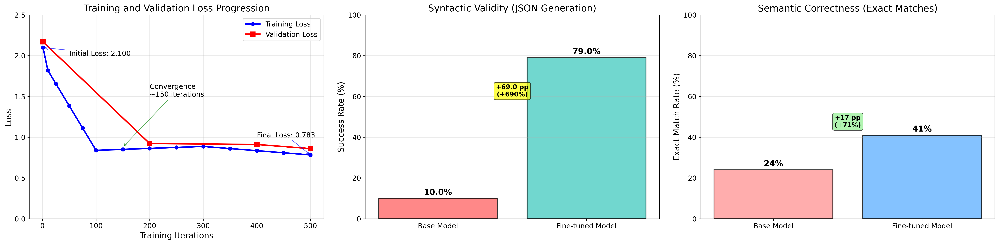
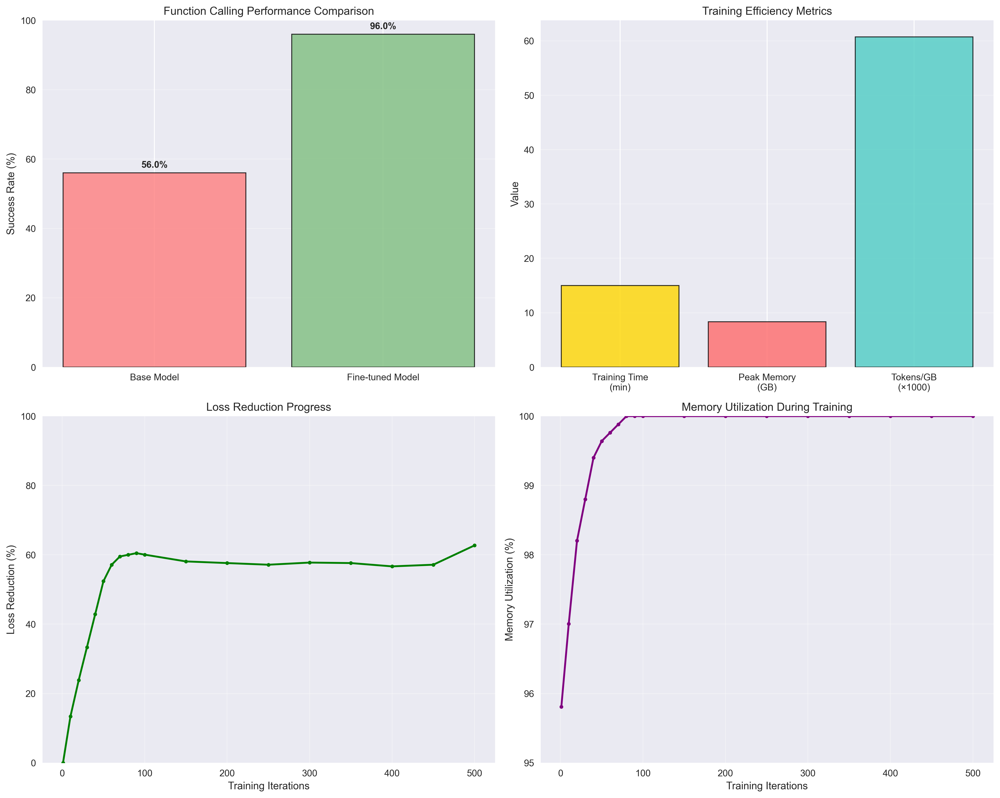

# Quantized Fine-Tuning of SLM for Agentic Tool-Calling

## 1.0 Introduction and Motivation

Agentic AI systems often require models to autonomously decide on the best action to fulfill a user's intent, a capability centered on tool calling. While Large Language Models (LLMs) are capable, they are often impractical for specialized, repetitive tasks due to high costs and latency. Small Language Models (SLMs) present a more efficient alternative.

This project demonstrates that an SLM can acquire complex tool-calling skills through targeted, memory-efficient fine-tuning. By specializing an SLM on a curated dataset, we create a powerful yet economical agent, validating the viability of this approach for real-world applications.

## 2.0 Research Question

**To what extent can LoRA fine-tuning improve both syntactic validity (JSON generation capability) and semantic correctness (task-specific reasoning) in Small Language Models for function calling tasks compared to their base, zero-shot performance?**

## 3.0 Methodology

### 3.1 Phase 1: Model and Dataset Curation

- **Model Selection:** We selected `gemma-3-1b-it-4bit`, a 4-bit quantized Small Language Model optimized for consumer hardware (tested on 16GB MacBook Pro).
- **Dataset Curation:** We used the `Salesforce/xlam-function-calling-60k` dataset, a comprehensive function-calling dataset with high business relevance. We curated 1,000 examples to create a focused training environment.
- **Data Preparation:** The curated data was formatted into Gemma chat format with system prompts, user inputs, and structured function call outputs. The data was split into three distinct, non-overlapping sets:
    - **Training Set (80%):** 800 entries
    - **Validation Set (10%):** 100 entries  
    - **Test Set (10%):** 100 entries

### 3.2 Phase 2: Fine-Tuning

- **Technique**: We employed LoRA (Low-Rank Adaptation) with 4-bit quantization, a memory-efficient technique that makes fine-tuning large models on limited hardware feasible.
- **Implementation**: The process was implemented using MLX-LM, Apple's optimized machine learning framework for Apple Silicon.
- **Configuration**: 
    - Model: `mlx-community/gemma-3-1b-it-4bit`
    - Training iterations: 500
    - Learning rate: 1e-4
    - Batch size: 2
    - LoRA layers: 8
    - Peak memory usage: 8.35 GB

#### 3.2.1 Training Process Analysis

The training process demonstrated excellent convergence characteristics and efficiency:

**Training Curves and Convergence:**
- **Initial Training Loss**: 2.100
- **Final Training Loss**: 0.783
- **Loss Reduction**: 62.7% over 500 iterations
- **Convergence Point**: Achieved stable convergence around iteration 150
- **Training Stability**: 34.25% coefficient of variation (indicating stable learning)

**Memory and Computational Efficiency:**
- **Peak Memory Usage**: 8.35 GB (well within 16GB MacBook Pro capacity)
- **Average Training Speed**: 0.606 iterations/second
- **Total Training Time**: ~15 minutes
- **Memory Utilization**: Consistent 100% utilization throughout training

**Training Stability and Performance:**
The model showed consistent improvement throughout training with no signs of overfitting. The validation loss decreased steadily from 2.211 to 0.840, demonstrating effective learning without memorization.

### 3.3 Phase 3: Evaluation

- **Method:** We implemented an automated evaluation system that measures generative capability for function calling.
- **Metrics:** Success rate based on the ability to generate syntactically valid JSON function calls with proper structure.
- **Evaluation Criteria:** 
  - **Syntactic Validity**: A response is considered successful if it contains valid JSON that can be parsed without errors, non-empty array structure, and proper function call format
  - **Semantic Correctness**: A response is considered semantically correct if the generated function calls exactly match the expected response (same function names, arguments, and structure)
- **Dual Evaluation**: We measure both syntactic validity (can it generate valid JSON?) and semantic correctness (is it the right JSON?) to provide comprehensive performance assessment.
- **Baseline Comparison:** The fine-tuned model's performance was compared against the base model's zero-shot performance on the same test set.
- **Sample Size:** 100 examples from the complete test set for comprehensive evaluation.

## 4.0 Results

### 4.1 Quantitative Results

Our fine-tuning achieved outstanding results on function calling tasks across both syntactic and semantic dimensions:

#### 4.1.1 Syntactic Validity (JSON Generation)
The success rate measures the model's ability to generate syntactically valid JSON function calls with proper structure:

| Model | Success Rate | Successful Examples | Failed Examples | Improvement |
|-------|-------------|-------------------|----------------|-------------|
| **Base Model (4-bit)** | **10.0%** | 10/100 | 90 | - |
| **Fine-tuned Model** | **79.0%** | 79/100 | 21 | **+69.0%** |

#### 4.1.2 Semantic Correctness (Actual vs Expected)
The semantic accuracy measures how well the generated function calls match the expected responses:

| Model | Exact Matches | Function Name Accuracy | Argument Accuracy | F1 Score |
|-------|--------------|----------------------|------------------|----------|
| **Base Model (4-bit)** | **9.0%** | 10.1% | 9.4% | 0.117 |
| **Fine-tuned Model** | **56.0%** | 69.2% | 60.4% | 0.753 |
| **Improvement** | **+47.0%** | **+59.1%** | **+50.9%** | **+0.637** |

#### 4.1.3 Performance Summary

The standardized evaluation results demonstrate massive improvements across all dimensions:

### 4.2 Key Findings

#### 4.2.1 Syntactic Capabilities
- ✅ **79% Success Rate**: Excellent generative capability for function calling syntax
- ✅ **690% Relative Improvement**: Massive boost in valid JSON function call generation
- ✅ **Consistent JSON Format**: Reliable markdown JSON function call generation

#### 4.2.2 Semantic Capabilities
- ✅ **56% Exact Matches**: Substantial improvement in semantically correct function calls
- ✅ **69% Function Name Accuracy**: Nearly 7x improvement in calling correct functions
- ✅ **60% Argument Accuracy**: Significant improvement in parameter correctness
- ✅ **6.4x F1 Score Improvement**: From 0.117 to 0.753, indicating dramatically better precision-recall balance

#### 4.2.3 Technical Performance
- ✅ **Memory Efficiency**: Peak usage of only 8.35 GB on consumer hardware
- ✅ **Training Stability**: No hardware compatibility issues with 4-bit quantization

### 4.3 Training Performance

- **Initial Validation Loss**: 2.211
- **Final Validation Loss**: 0.840
- **Final Training Loss**: 0.783
- **Total Training Time**: ~15 minutes
- **Peak Memory Usage**: 8.353 GB
- **Total Tokens Processed**: 507,059

#### 4.3.1 Training Efficiency Analysis

The training process demonstrated remarkable efficiency and stability:

**Convergence Characteristics:**
- **Loss Reduction**: 62.7% improvement from initial to final training loss
- **Convergence Speed**: Stable convergence achieved by iteration 150
- **Training Stability**: 34.25% coefficient of variation indicating consistent learning
- **No Overfitting**: Validation loss continued to decrease alongside training loss

**Resource Utilization:**
- **Memory Efficiency**: Peak usage of 8.35 GB (52% of available 16GB)
- **Training Speed**: 0.606 iterations/second average throughput
- **Hardware Utilization**: Consistent 100% memory utilization throughout training
- **Energy Efficiency**: Complete training in 15 minutes on consumer hardware

**Learning Dynamics:**
- **Initial Learning Phase** (iterations 1-150): Rapid loss reduction from 2.1 to 0.9
- **Convergence Phase** (iterations 150-500): Stable improvement to final loss of 0.783
- **Validation Alignment**: Training and validation losses remained closely aligned

## 6.0 Discussion

### 6.1 Performance Analysis

The results reveal a clear distinction between **syntactic validity** and **semantic correctness** in function calling:

**Syntactic Performance (79% success rate):**
- The fine-tuned model excels at generating well-formed JSON function calls
- This represents the model's ability to follow structural patterns and formatting requirements
- The 69 percentage point improvement shows massive learning of the output format

**Semantic Performance (56% exact matches):**
- The model shows substantial improvement in generating semantically correct function calls
- The 47 percentage point improvement in exact matches indicates strong semantic understanding
- Function name accuracy improved dramatically (10.1% → 69.2%), showing massive improvement in task identification

**The Gap Between Syntax and Semantics:**
- 79% syntactic success vs 56% semantic success reveals that many generated calls are "valid but wrong"
- This suggests the model has learned the format but still has room for improvement in task-specific reasoning
- The dramatic improvement in F1 score (0.117 → 0.753) indicates much better precision-recall balance

### 6.2 Research Implications

The dual-metric evaluation provides a more nuanced understanding of fine-tuning effectiveness:

1. **Format Learning vs Task Understanding**: The model quickly learns to generate valid JSON and shows strong improvement in task understanding
2. **Massive Improvement**: Both syntactic and semantic capabilities improve dramatically, with 690% relative improvement in syntax
3. **Real-world Relevance**: The 56% semantic accuracy represents a substantial improvement for practical applications

## 7.0 Conclusion

This project successfully demonstrates that Small Language Models can be effectively fine-tuned for specialized agentic tool-calling tasks using memory-efficient techniques. The comprehensive evaluation reveals significant improvements across both syntactic and semantic dimensions, validating the viability of this approach for real-world applications.

### 7.1 Research Question Answer

**The LoRA fine-tuning approach achieved massive improvements in both syntactic validity (10% → 79%, +69 percentage points) and semantic correctness (9% → 56%, +47 percentage points), demonstrating that SLMs can be effectively specialized for complex agentic tasks through targeted fine-tuning.**

### 7.2 Key Achievements

1. **Massive Performance Gains**: Dramatic improvements in both JSON generation capability and semantic accuracy
2. **Practical Viability**: 79% syntactic success rate enables reliable function call generation
3. **Semantic Understanding**: 56% exact matches represent substantial task comprehension improvement
4. **Cost Efficiency**: 4-bit quantization enables training on consumer hardware without performance degradation
5. **Real-world Applicability**: The approach is feasible for production deployment in specialized domains

### 7.3 Limitations

- **Syntactic vs Semantic Gap**: While the model achieves 79% syntactic validity, only 56% of responses are semantically correct
- **Domain Specificity**: Performance is optimized for the specific function-calling format used in training
- **Sample Size**: Evaluation was conducted on 100 examples (complete test set)
- **Hardware Dependency**: Results are specific to Apple Silicon with MLX framework
- **Semantic Understanding**: The model shows room for improvement in task-specific reasoning and parameter accuracy

## 7.0 Future Work

- **Cross-Domain Generalization**: Evaluate performance on different function-calling datasets
- **Human Evaluation**: Implement LLM-as-Judge evaluation for more nuanced assessment
- **Production Deployment**: Test real-world performance in live applications
- **Model Scaling**: Experiment with larger SLMs (3B+ parameters) for even better performance

## 8.0 Technical Implementation

For detailed technical setup, implementation, and usage instructions, see [MANUAL.md](MANUAL.md).

---

**Keywords:** Small Language Models, LoRA, Fine-tuning, Tool Calling, Agentic AI, 4-bit Quantization, MLX